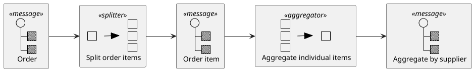
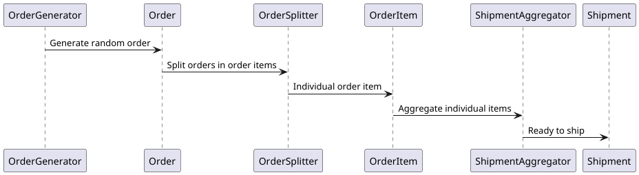
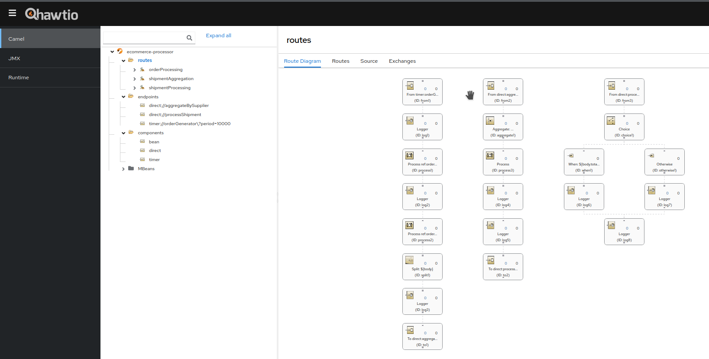
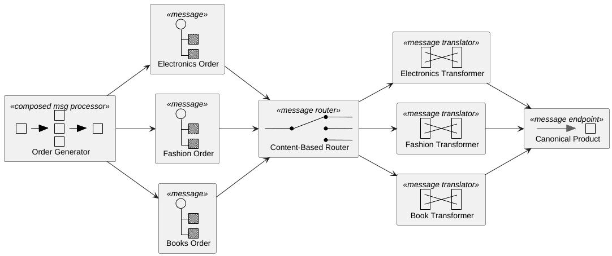
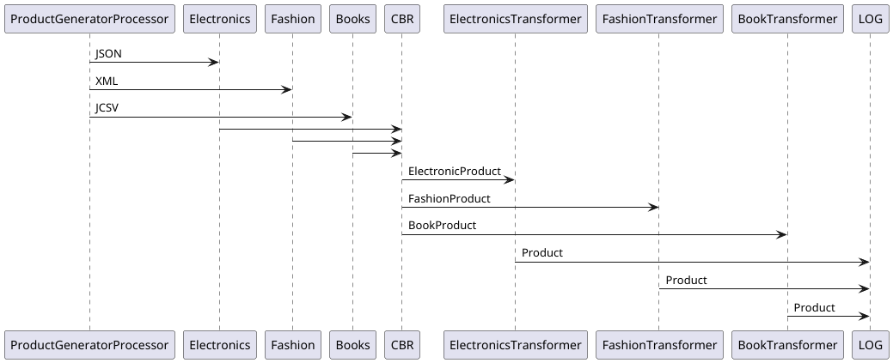
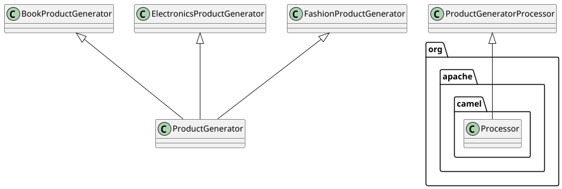
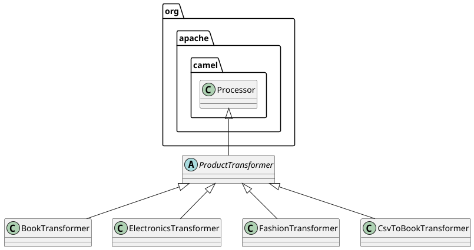
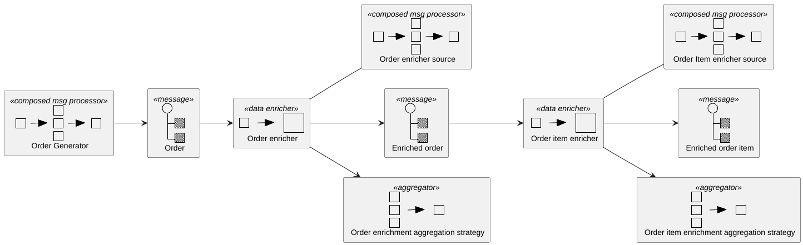
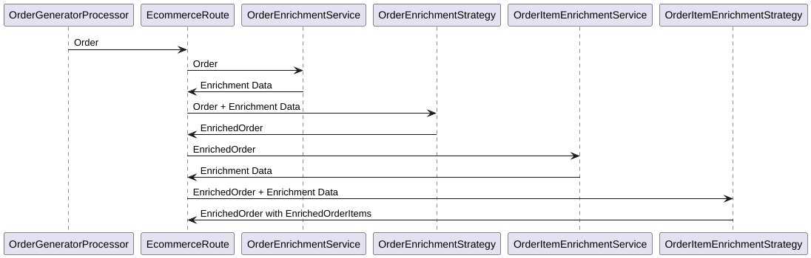

# EIP: Back to Fundamentals !

AI, LLM, ML, NLP, ... Unless you've been living under a rock for the past two years,
you've probably had your fill of these syntagma. As for me, I can't read on this
site, or anywhere else in the tech community, any IT post or article, without being 
bombarded with these acronyms, by an endless stream of self-proclaimed AI gurus.
Everyone wants to demonstrate, through pages of listing, how to do RAG or MCP,
all this such that, finally, to be able to ask a model stupid things like the 
first names of the four Beatles or what does a crocodile eat for the dinner.

In my opinion, there is currently a real overwhelming amount of AI hype and 
buzzword fatigue in the tech community. At such an extent that I felt a 
compelling need to return to fundamentals. And, in my case, these fundamentals where the EIP
(*Enterprise Integration Patterns*). Accordingly, I searched my library for the
Hohpe and Wolf black book, I removed the dust from its cover and I started to 
read it again, from the beginning to end.

I use to react to posts on this site recommending books, like *Clean Architecture*,
published 8 years ago, which I consider outdated. It happened also to me recently to 
advice against *Spring in Action*, published initially in 2019 and currently in
its 6th edition, dated 2022. So, this book has been published 6 times in 3 years !
Which wasn't obviously enough to cover its full spectrum as it still lacks lots
of topics.

Anyway, if I'm dwelling on this subject here, this is to say that I'm not really
a big fan of old books because, in our field, things are changing so fast, for 
the best and for the worst. But this EIP book, published in 2003, is incredibly
up to date.

So, after reading it again more than 20 years later, I thought that I definitely need to 
contribute somehow to promote these EIPs which, in my opinion, represent the most
important foundation of the software industry. And the only way I found to 
contribute is to provide *sui generis* implementations of these EIPs. 

But once this decision taken, the difficulty of the technology-agnostic requirement
of such implementations appears immediately. How to implement these patterns without
getting bound to any technology or product ? As the book's authors state in its 
preface, they would have been tempted to provide implementations as well but, 
given the wide diversity of the suitable products and technologies, the book 
would have been "likely to never finish or else to be published so late as to 
be irrelevant". 

It's valuable to see the authors' concern to avoid a possible irrelevance of their
work, due to a too late publishing date, but they may be at ease that this isn't 
the case, even today, more than 20 years after. And since, in any case, a 
technology-agnostic implementation would be neither possible, nor useful, I 
choose the one and only Java based enterprise grade integration platform: 
Apache Camel.

This having beed said, I'm planning to take, one by one, most of the EIPs in the Hohpe
and Wolf book and to implement them, using Apache Camel and its Quarkus extensions.
And while I'm at it, I'll try to find credible and realistic use cases, extracted
from my daily experience with enterprise grade applications, far from the "hello
world" residual examples. I'm not sure how useful my approach might be, but I 
really need to contribute to this foundation, if only in the most modest way
possible. 

The Hohpe and Wolf book is organized in a very systematical and methodical way,
based on the patterns classifications. But I won't follow the same approach. 
Instead, I'm proceeding in alphabetical order. And since the first pattern, in
the alphabetical order, is the *aggregator*,I'm starting with it. This might 
not seem to be a very pedagogical approach as the *aggregator* is probably one
of the most complex patterns and the professional practice is to start from 
simple to complex, not the other way around. But having gone through the book,
from beginning to end, is one of the pre-requisites here, accordingly, I thought
that the patterns order isn't essential.

As you'll see, each pattern implementation is documented 
by its associated README.md file, observing the same template. This template 
consists in the following paragraphs: 

  - Scenario: this is a short description of the business case chosen to illustrate the pattern.
  - Architecture: the software architecture, i.e. the libraries, the frameworks, the dependencies, the extensions, etc. if any, required by the implementation.
  - Flow: a simple graphical sketch of the use case showing the involved components in a similar way to a sequence diagram.
  - Key components: description of the most important components and their role.
  - Business value: optional.
  - Test and run: full instructions guiding how to test and run the case.

So, let's start !

## The Aggregator

This project demonstrates Apache Camel's **Splitter** and **Aggregator** patterns using a realistic e-commerce scenario.

### Scenario

An e-commerce platform processes orders that contain items from multiple suppliers. The system:
  1. **Splits** orders into individual items
  2. **Aggregates** items by supplier and shipping address to optimize shipments
  3. Creates consolidated shipments for cost efficiency

### Architecture

The diagram below shows the software architecture of the implementation. 



Everything starts with the `OrderGenerator` processor which generates random test
orders. These orders are instances of the `Order` record. They are generated on 
time based frequency, one every 10 seconds, using the `timer` Camel component.

Once generated, each order is split in a list of its corresponding `OrderItem` 
instances, by the `OrderSplitter` Camel processor. After which, the individual 
`OrderItem` instances are aggregated, based on their supplier ID and shipping 
address, into instances of `Shipment`. This is the role of the `ShipmentAggregator`
Camel processor which defines the aggregation strategy.

Last but not least, the `Shipment` instances, ready to be delivered, are just 
printed out in the Camel log file. In a real case, of course, they would have 
been sent to a delivery channel.

### Flow

The following sequence diagram is illustrating the implementation's flow:



### Key Components

- **OrderSplitter**: Breaks orders into individual items with context
- **ShipmentAggregator**: Groups items by supplier + shipping address
- **OrderGenerator**: Creates realistic sample orders

The `OrderSplitter` class implements the `Processor` Camel interface and, in 
its `process(Exchange exchange)` method, it splits an `Order` instance, passed as
an input message, to its corresponding `OrderItem` instances list.

Here is the source code:

    @ApplicationScoped
    @Named("orderSplitter")
    public class OrderSplitter implements Processor
    {
      @Override
      public void process(Exchange exchange) throws Exception
      {
        Order order = exchange.getIn().getBody(Order.class);
        List<OrderItem> enrichedItems = order.items().stream()
          .map(item -> item.withOrderContext(order.orderId(), 
            order.shippingAddress()))
          .toList();
        exchange.getIn().setBody(enrichedItems);
      }
    }

As for the `ShipmentAggregator`, it performs the complementary operation of 
grouping the individual `OrderItem` instances, issued from the splitting process,
using an aggregation key which consist in the concatenation of the supplier ID 
and the shipment address.

    @ApplicationScoped
    @Named("shipmentAggregator")
    public class ShipmentAggregator implements AggregationStrategy
    {
      @Override
      public Exchange aggregate(Exchange oldExchange, Exchange newExchange)
      {
        OrderItem newItem = newExchange.getIn().getBody(OrderItem.class);
        @SuppressWarnings("unchecked")
        List<OrderItem> items = Optional.ofNullable(oldExchange)
          .map(ex -> (List<OrderItem>) ex.getIn().getBody(List.class))
          .orElse(new ArrayList<>());
        items.add(newItem);
        Exchange exchange = Optional.ofNullable(oldExchange)
          .orElse(newExchange);
        exchange.getIn().setBody(items);
        return exchange;
      }

      public Shipment createShipment(List<OrderItem> items)
      {
        return items.stream()
         .findFirst()
         .map(first -> new Shipment(first.supplierId(), first.shippingAddress(), items))
         .orElse(null);
      }
    }

The code above accumulates `OrderItems` instances, having the same aggregation 
key, into a single list. It accepts two input arguments: 

  - the `oldExchange` which represents the current state accumulated from previous aggregations; it is null initially;
  - the `newExchange` containing the incoming message;

The `oldExchange` argument is checked for the null value, i.e. no previous 
accumulation exists and, then, a new item list is instantiated. Otherwise, if
the `oldExchange` isn't null, then the list of the previously accumulated 
`OrderItem` is extracted from it and the new `OrderItem` instance is added to 
it from the `newExchange` argument.

### Business Value

- **Cost Reduction**: Fewer shipments per supplier
- **Efficiency**: Consolidated deliveries
- **Scalability**: Handles multiple suppliers automatically

### Running the Application

In order to run the application, perform the following steps:

```bash
$ git clone https://github.com/nicolasduminil/eip.git
$ cd eip
$ mvn package
$ java -jar aggregator/target/quarkus-app/quarkus-run.jar
```

Now the application is up and running. It will:
  - Generate sample orders every 10 seconds
  - Split orders by supplier
  - Aggregate items into optimized shipments
  - Log the entire process

The route labeled `orderProcessing`, which triggers the whole flow, is declared
with `autoStartup(false)` in the `ECommerceRoute` class. This means that it won't
be started automatically but, in order to give you full control, it should be 
handled via the Hawtio console. The following Maven dependency:

    ...
    <dependency>
      <groupId>io.hawt</groupId>
      <artifactId>hawtio-quarkus</artifactId>
      <version>4.4.1</version>
    </dependency>
    ...

includes the Hawtio console in your application JAR. Then by fireing your prefered
browser at http://localhost:8080/hawtio, you'll see something similar to the 
picture below:



Now, go to `Camel->Routes->orderProcessing` and, in the right most pane, select
the tab labeled `Operations`. Then scrool down until you see the method 
`void start()`. Unfold it and click the red button `Execute`. The message `Operation
successful` should be displayed and the route will start. You can tell that as
your Camel log file will show trace messages.

Executing the `String getState()` method will show that the route is active. 
Whenever you think that you finished experiencing with th use case, you can 
execute the method `void stop()` and the process will terminate. Don't hesitate
to play with different operations exposed here, in the Hawtio console.

### Sample Output

```
=== Processing new order ===
Generated order: Order{orderId='ORD-123', customerId='CUST-456', items=5}
Processing item: OrderItem{productId='LAPTOP-1', supplierId='SUPPLIER_ELECTRONICS', quantity=2}
=== SHIPMENT CREATED ===
Shipment: Shipment{id='SHIP-SUPPLIER_ELECTRONICS-123', supplier='SUPPLIER_ELECTRONICS', items=2, value=250.50}
HIGH VALUE shipment (250.50€) - Priority processing
```

### Key Patterns Demonstrated

- **Splitter Pattern**: `split(body())` breaks orders into items
- **Aggregator Pattern**: Groups by `aggregationKey` (supplier + address)
- **Content-Based Router**: Routes high-value shipments differently

## The Canonical Data Model

This project demonstrates how to implement a simple, yet realistic, business case
that uses the Canonical Data Model enterprise pattern.

### Scenario

An online marketplace aggregates products from multiple suppliers with different
data formats:

  - Supplier A (Electronics): JSON format with nested specifications.
  - Supplier B (Fashion): XML format with size/color variants.
  - Supplier C (Books): CSV format with ISBN/author details.

All supplier formats are transformed to a canonical `Product` model for unified
catalog management, search, and display.

#### Sample Data Format for Supplier A

This supplier uses JSON as the data format.

    {
      "item_id": "ELEC001",
      "name": "Gaming Laptop",
      "cost": 1299.99,
      "specs": {"cpu": "Intel i7", "ram": "16GB"}
    }

#### Sample Data Format for Supplier B

This supplier uses XML as the data format.

    <product>
      <sku>FASH002</sku>
      <title>Designer Jacket</title>
      <price>299.50</price>
      <variants>
        <variant size="M" color="Blue"/>
      </variants>
    </product>

#### Sample Data Format for Supplier C

This supplier uses CSV as the data format.

    isbn,book_title,author,retail_price
    978-0134685991,Effective Java,Joshua Bloch,45.99

### Architecture

The diagram below shows the software architecture of the implementation:



Everything starts with the `ProductGeneratorProcessor` which generates random 
test products in JSON, XML or CSV notation. So, supplier A provides
electronics products in JSON format, supplier B fashion ones in XML format, as for
the supplier C, they provide books in CSV format.

The messages are generated on a time based frequency, one every 15 seconds, using
the `timer` Camel component. Once generated, these messages are passed to a CBR
(*Content Based Router*) which marshals each payload to its 
Java corresponding record type, as follows:

  - JSON messages, coming from the Supplier A, are marshaled to instances of `ElectronicsProduct` record type;
  - XML messages, coming from the supplier B, are marshaled to instances of `FashionProduct` record type;
  - CSV messages, coming from the supplier C, are marsheled to instances of `BookProduct` record type.

These Java record instances are further processed by dedicated processors, as 
follows:

  - `ElectricsProduct` instances are trasformed by the `ElectronicsTransformer` processor to `Product` canonical instances;
  - `FashionProduct` instances are transformed by the `FashionTransformer` processor to canonical `Product` instances;
  - `BookProduct` instances are transformed by the `BookTransformer` processor to canonical `Product` instances.

All these processors are subclasses of the abstarct class `ProductTransformer` 
which implements the transformation general strategy, while bein specialized 
by each concrete subclass.

Last but not least, the `Product` instances, ready to be shipped, are just
printed out in the Camel log file. In a real case, of course, they would have
been sent to a delivery channel.

### Flow

The following sequence diagram is illustrating the implementation's flow:



### Key Components

  - **Generators**. A set of generators are available in order to generate test data. They generate data in a supplier specific format, i.e. JSON for the Supplier A, XML for the supplier B and CSV for the supplier C. They all implement the `ProductGenerator` interface. See the class diagram below:



  - **Transformers**. A set of transformers responsible for mapping the specific data model to the canonical one. See the class diagram below:



  - **BookProduct**. A record modeling a Supplier C specific product representation.
  - **ElectronicsProduct**. A record modeling a Supplier A specific product representation.
  - **FashionProduct**. A record modeling a Supplier B specific product representation.
  - **Product**. A record modeling a canonical product representation.
  - **ProductCatalogRoute**. The Camel main route. Its listing is shown below:

Here below is the listing of the `ProductCatalogRoute` class which defines the 
Camel routes required by our implementation. 

    @ApplicationScoped
    public class ProductCatalogRoute extends RouteBuilder
    {
      @Override
      public void configure() throws Exception
      {
        from("timer:generator?period=15000")
         .routeId("dataGenerationRoute")
         .autoStartup(false)
         .process("productGenerator")
         .to("direct:processProduct");
       from("direct:processProduct")
        .routeId("dataProcessingRoute")
        .choice()
          .when(header("supplierType").isEqualTo("ELECTRONICS"))
            .unmarshal().json(JsonLibrary.Jackson, ElectronicsProduct.class)
            .process("electronicsTransformer")
          .when(header("supplierType").isEqualTo("FASHION"))
            .unmarshal().jacksonXml(FashionProduct.class)
            .process("fashionTransformer")
          .when(header("supplierType").isEqualTo("BOOKS"))
            .unmarshal().csv()
            .process("csvToBookTransformer")
            .process("bookTransformer")
        .end()
        .to("log:canonical-product?showBody=true");
      }
    }

### Sample output

    ... Body: Product[id=ELEC001, name=Gaming Laptop, price=1299.99, category=Electronics, attributes={specifications={cpu=Intel i7, ram=16GB}}, supplierId=SUPPLIER_A]]
    ... Body: Product[id=FASH002, name=Designer Jacket, price=299.50, category=Fashion, attributes={variants=[Variant[size=M, color=Blue]]}, supplierId=SUPPLIER_B]]
    ... Body: Product[id=ELEC001, name=Gaming Laptop, price=1299.99, category=Electronics, attributes={specifications={cpu=Intel i7, ram=16GB}}, supplierId=SUPPLIER_A]]
    ... Body: Product[id=FASH002, name=Designer Jacket, price=299.50, category=Fashion, attributes={variants=[Variant[size=M, color=Blue]]}, supplierId=SUPPLIER_B]]
    ... Body: Product[id=FASH002, name=Designer Jacket, price=299.50, category=Fashion, attributes={variants=[Variant[size=M, color=Blue]]}, supplierId=SUPPLIER_B]]
    ... Body: Product[id=978-0134685991, name=Effective Java, price=45.99, category=Books, attributes={author=Joshua Bloch}, supplierId=SUPPLIER_C]]
    ... Body: Product[id=FASH002, name=Designer Jacket, price=299.50, category=Fashion, attributes={variants=[Variant[size=M, color=Blue]]}, supplierId=SUPPLIER_B]]

## The Content Enricher

Let's continue with the next integration patter in alphabetical order. We skip the Channel Adapter and the Content Based
Router, that we have already seen in the two previous modules, `aggregator` and `canonical-data-model`, ro go to the next
relevant one which is the Content Enricher. The name of the module is, with no surprises, `content-enricher`.

### Scenario

The business scenario chosen to illustrate this pattern is presented below:



Here we're coming back to our business scenario previously used to illustrate the Aggregator pattern. The same order
generator is reused here to generate several random orders. Once generated, these orders are submitted to an enrichment
process. A Camel enricher is implemented by the `enrich` DSL statement which uses the following two components:

  - an enrichment source responsible to provide the enrichment data;
  - an enrichment aggregator which, on the behalf of its aggregation strategy, describes the enrichment logic.

The enrichment process happens in two stages:

  - in the 1st stage, the order item enricher is called in order to provide the required data for the order items enrichment. Then, the order item aggregator effectively performs the enrichment operations, by adding the enrichment data to the existent one;
  - in the 2nd stage, is the turn of the order itself to be enriched. In a similar way, the order enrichment source is called in order to provide the enrichment data, after which the order enrichment aggregator performs the enrichment.

The Content Enricher pattern beauty consists in its ability to progressively add data from external sources while 
maintaining clean separation of the components.

### Architecture

The diagram below shows the software architecture of the implementation:



As you can see, the two stages of the enrichment process are distinctly represented here. The `EcommerceRoute` class is
our Camel `RouteBuilder`. It uses our old friend `OrderGeneratorProcessor` to generate orders and the 
`OrderItemEnrichmentService`, together with `OrderItemEnrichmentStrategy`, to construct orders having their `enrichedItems`
properties enriched with the product details. Then, on the behalf of `OrderEnrichmentService` and `OrderEnrichmentStrategy`,
it enriches the orders themselves, by adding to them the customer details.

### Key components

There are two categories of key components for this implementation: the enrichment source services and the enrichment
strategies. The enrichment source services are simulated in our case. For example, the `OrderEnrichmentService` is as
simple as that:

    @ApplicationScoped
    @Named("orderEnrichmentService")
    public class OrderEnrichmentService implements Processor
    {
      @Override
      public void process(Exchange exchange) throws Exception
      {
        CustomerDetails customerDetails = new CustomerDetails(
          "John Doe",
          "john@example.com",
          "GOLD"
        );
        exchange.getIn().setBody(customerDetails);
      }
    }

In a real application, these enrichment data should probably be extracted from a data store or provided by invoking some
API endpoints. In our simple case, which is a test case, we are just hard coding them. A point to notice is the fact that
a Camel enrichment source only provides the enrichment data and, accordingly, it isn't responsible for effectively doing
the enrichment process. This is the role of the aggregation strategies which, in some cases may be quite simple, as shown
below:

    @ApplicationScoped
    @Named("orderEnrichmentStrategy")
    public class OrderEnrichmentStrategy implements AggregationStrategy
    {
      @Override
      public Exchange aggregate(Exchange original, Exchange enrichment)
      {
        EnrichedOrder enrichedOrder = original.getIn().getBody(EnrichedOrder.class);
        CustomerDetails customerDetails = enrichment.getIn().getBody(CustomerDetails.class);
        original.getIn().setBody(enrichedOrder.withCustomerDetails(customerDetails));
        return original;  
      }
    }

Here the aggregation strategy is really straightforward as it consists in simply enriching the order with customer 
details. But some other times the strategy is much more complicated, as for example when enriching the enriched order 
items of the enriched orders, by adding to them the product details.

    @ApplicationScoped
    @Named("orderItemEnrichmentStrategy")
    public class OrderItemEnrichmentStrategy implements AggregationStrategy
    {
      @Override
      public Exchange aggregate(Exchange original, Exchange enrichment)
      {
        Order order = original.getIn().getBody(Order.class);
        Map<String, ProductDetails> productMap = enrichment.getIn().getBody(Map.class);
        //
        // Transform order items to enriched order items:
        //   find matching product details for each item,
        //   create EnrichedOrderItem if match found,
        //   filter out items without matches
        //
        List<EnrichedOrderItem> enrichedItems = order.items().stream()
          .map(item -> findProductDetails(productMap, item.productId())
          .map(pd -> new EnrichedOrderItem(item, pd)))
          .filter(Optional::isPresent)
          .map(Optional::get)
          .toList();
        EnrichedOrder fullyEnriched = new EnrichedOrder(
          order.orderId(),
          order.customerId(),
          order.shippingAddress(),
          order.orderDate(),
          null,
          enrichedItems
        );
        original.getIn().setBody(fullyEnriched);
        return original;
      }

      private Optional<ProductDetails> findProductDetails(Map<String, ProductDetails> productMap, String productId)
      {
        //
        // Extract the product ID prefix
        //
        String productPrefix = productId.split("-")[0];
        //
        // Returns the `ProductDetails` instance which ket name starts
        // with the prefix ID prefix.
        //
          return productMap.entrySet().stream()
            .filter(entry -> entry.getKey().startsWith(productPrefix))
            .map(Map.Entry::getValue)
            .findFirst();
      }
    }

As you can see, the difficulty here consists in the fact that we need to find the product details that match the order 
items that we want to enrich, hence these quite convoluted filters and maps statements.

### Testing

Camel routes are easy to test using the Hawtio console, as we've seen precedently. Quarkus provides a test framework 
covering the wide spectrum, fom unit to E2E, passing through integration tests.
For example, look at the following integration test:

    @QuarkusTest
    public class TestEcommerceRoute
    {
      @Inject
      CamelContext camelContext;

      @Inject
      ProducerTemplate producerTemplate;

      @Test
      public void testContentEnricherDemo() throws Exception {
        Order testOrder = new Order(
          "BOOK-1820",
          "CUST-123",
          "123 Test St",
          LocalDateTime.now(),
          List.of(new OrderItem("BOOK-1", "Computer book",
            "SUPPLIER_BOOKS", 1, new BigDecimal(41.75)))
          );
        Exchange result = producerTemplate.request("direct:enrichOrder",
        exchange -> exchange.getIn().setBody(testOrder));
        EnrichedOrder enrichedOrder = result.getIn().getBody(EnrichedOrder.class);
        assertNotNull(enrichedOrder, "Enriched order should not be null");
        assertEquals("BOOK-1820", enrichedOrder.orderId());
        assertNotNull(enrichedOrder.customerDetails(), "Customer details should be enriched");
        assertFalse(enrichedOrder.enrichedItems().isEmpty(), "Items should be present");
        EnrichedOrderItem enrichedItem = enrichedOrder.enrichedItems().get(0);
        assertNotNull(enrichedItem.productDetails(), "Product details should be enriched");
      }
    }

As you can see, instead of using mocks, we're using here real Camel routes and processors. It's a special kind of
integration tests, unique to Quarkus, which runs in the same JVM as the test runner, which by the way, allows us to
inject the `CamelContext`, as well as the `ProducerTemplate`.

Quarkus provides also provides the `@QuarkusIntegrationTest` annotation which, as opposed to what its name implies, 
doesn't annotate integration tests, but E2E ones. he Quarkus naming is indeed confusing and counterintuitive. This is a 
common complaint in the community.

### Sample output

    2025-08-16 00:07:04,144 INFO  [contentEnricherDemo] (Camel (camel-1) thread #1 - timer://orderGenerator) === ORDER ===
    2025-08-16 00:07:04,216 INFO  [contentEnricherDemo] (Camel (camel-1) thread #1 - timer://orderGenerator) Order {orderId = 'ORD-1755295624138', customerId = 'CUST-801', items = 5}
    2025-08-16 00:07:04,216 INFO  [content-enricher] (Camel (camel-1) thread #1 - timer://orderGenerator) Exchange[ExchangePattern: InOnly, BodyType: fr.simplex_software.ecommerce.model.Order, Body: Order {orderId = 'ORD-1755295624138', customerId = 'CUST-801', items = 5}]
    2025-08-16 00:07:04,226 INFO  [orderItemEnrichment] (Camel (camel-1) thread #1 - timer://orderGenerator)         >>> Product details retrieved: {BOOK-1=ProductDetails[name=Java Guide, price=45.99, category=Books, stockLevel=100], FASHION-1=ProductDetails[name=T-shirt, price=19.99, category=Fashion, stockLevel=200], LAPTOP-1=ProductDetails[name=Gaming Laptop, price=1299.99, category=Electronics, stockLevel=25]}
    2025-08-16 00:07:04,230 INFO  [orderEnrichment] (Camel (camel-1) thread #1 - timer://orderGenerator)     >>> Customer details retrieved: CustomerDetails[name=John Doe, email=john@example.com, loyaltyTier=GOLD]
    2025-08-16 00:07:04,231 INFO  [doEnrichment] (Camel (camel-1) thread #1 - timer://orderGenerator) === ENRICHED ORDER ===
    2025-08-16 00:07:04,238 INFO  [doEnrichment] (Camel (camel-1) thread #1 - timer://orderGenerator) EnrichedOrder[orderId=ORD-1755295624138, customerId=CUST-801, shippingAddress=789 Pine Rd, Marseille, orderDate=2025-08-16T00:07:04.141387943, customerDetails=CustomerDetails[name=John Doe, email=john@example.com, loyaltyTier=GOLD], enrichedItems=[EnrichedOrderItem[orderItem=OrderItem {productId = 'LAPTOP-87', supplierId = 'SUPPLIER_ELECTRONICS', quantity = 2}, productDetails=ProductDetails[name=Gaming Laptop, price=1299.99, category=Electronics, stockLevel=25]]]]
    2025-08-16 00:07:04,239 INFO  [content-enricher] (Camel (camel-1) thread #1 - timer://orderGenerator) Exchange[ExchangePattern: InOnly, BodyType: fr.simplex_software.ecommerce.model.EnrichedOrder, Body: EnrichedOrder[orderId=ORD-1755295624138, customerId=CUST-801, shippingAddress=789 Pine Rd, Marseille, orderDate=2025-08-16T00:07:04.141387943, customerDetails=CustomerDetails[name=John Doe, email=john@example.com, loyaltyTier=GOLD], enrichedItems=[EnrichedOrderItem[orderItem=OrderItem {productId = 'LAPTOP-87', supplierId = 'SUPPLIER_ELECTRONICS', quantity = 2}, productDetails=ProductDetails[name=Gaming Laptop, price=1299.99, category=Electronics, stockLevel=25]]]]]

### Key Patterns Demonstrated

  - Enrichment source services 
  - Aggregation strategies (merge original + enrichment data)
  - Route orchestration (coordinate the enrichment flow)
